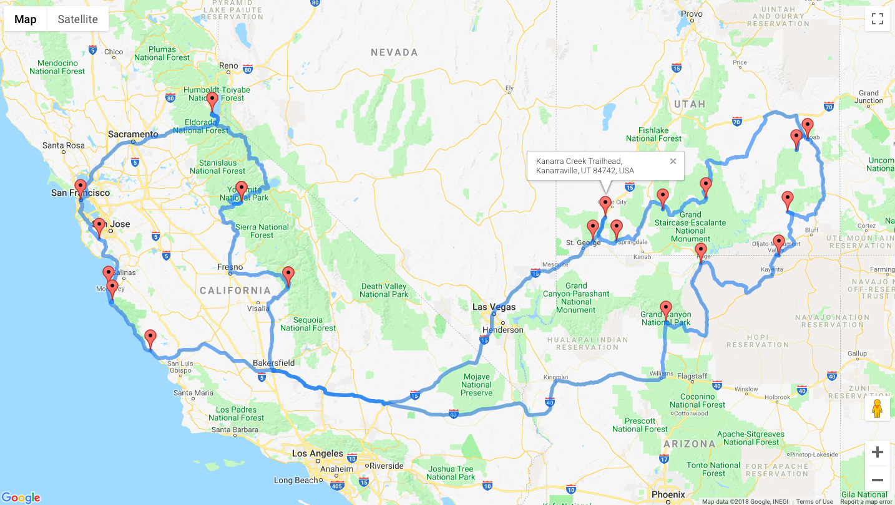
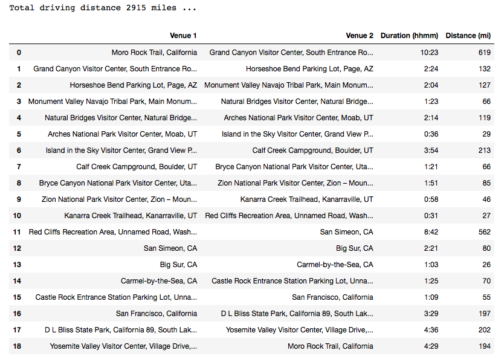

# Road Trip Optimization

Use a genetic algorithm to determine the optimal driving route between up to 70 points of interest. 

Visualize the optimal route in your web browser with Google Maps.



Review in tabular form the driving distances and durations between each point of interest in the optimal route.



## Acknowledgements

This project was made possible by [Randal S. Olson](http://www.randalolson.com/) and his notebook, [Computing the optimal road trip across the U.S.](https://github.com/rhiever/Data-Analysis-and-Machine-Learning-Projects/blob/master/optimal-road-trip/Computing%20the%20optimal%20road%20trip%20across%20the%20U.S..ipynb). All credit for the genetic algorithm code and the query Google Maps API code goes to him with a few adjustments made by me. See [data_collection.py](./src/data_collection.py) and [genetic_algorithm.py](./src/genetic_algorithm.py) for more details.

## Getting Started

### Download the repository

Click  `Clone or download`  and `Download as ZIP`. Once the download is complete, unzip the file and drag it onto your Desktop. 

### Setup a virtual environment

The next step is to create a virtual environment on your computer. This environment will hold the Python version and packages necessary for road trip optimization. We can build the environment using the [Anaconda Distribution](https://www.anaconda.com/what-is-anaconda/), a popular Python data science platform for package management and deployment. If you already have Anaconda installed, move on to the next step. Otherwise, [download Anaconda here](https://www.anaconda.com/download/). 

To confirm Anaconda is installed correctly, open a terminal window and run:

```
conda --version
```

You should see the installed version number, such as `conda 4.3.27`. If instead you see an error message, reference [Verifying that conda is installed](https://conda.io/docs/user-guide/tasks/manage-conda.html) in the conda documentation.

With Anaconda correctly installed, you can use the `environment.yml` file to create a virtual environment on your computer. In the terminal, navigate to the road-trip-optimization directory using the command `cd <folder path>`. Once in the correct directory, run:

```
conda env create -f environment.yml
```

You can now "enter" the new virtual environment with:

```
source activate road-trip
```

Verify the road-trip environment was installed correctly using:

```
conda list
```

You should see a list of packages and package versions installed in your environment, such as `python    3.6.6` . If instead you see an error message, reference [Creating an environment from an environment.yml file](https://conda.io/docs/user-guide/tasks/manage-environments.html#creating-an-environment-from-an-environment-yml-file) in the conda documentation.

### *Alternative : Install necessary packages*

You will need `Python 3.5` or greater along with the `pandas`, `googlemaps`, and `jupyter` packages to successfully run the road trip optimization program.

### Get a Google Maps API key
You'll need a Google Maps API key in order to collect driving distance and duration information. Fortunately, these keys are available for free with a Google Account. To get an API key:

1. Visit https://developers.google.com/console and log in with your Google Account
2. Create a new project
3. Enable the Distance Matrix API
4. Create a new Server key
5. Copy your new API key
6. Open your favorite text editor and type:

```
# Enter your Google Maps API key
GOOGLE_MAPS_API_KEY = "Paste Your API Key Here"
```
7. Ensure you pasted your API key between the " "
8. Save this file as `config.py` in the road-trip-optimization directory on your Desktop

### Run the program
You are now ready to optimize your road trip!

Go to the terminal window where you activated your road-trip environment and run:

```
jupyter notebook
```

A window should open in your web browser with what looks like your folder directory. If the window does not open automatically, copy/paste the URL in the terminal to your favorite web browser.

Navigate through the folder structure to the road-trip-optimization directory on your Desktop. Open the `Road Trip Optimization.ipynb` file. Follow the instructions in the notebook and press `Shift + Enter` to run the code in each cell.

Congratulations you are now a road trip optimizing machine!
